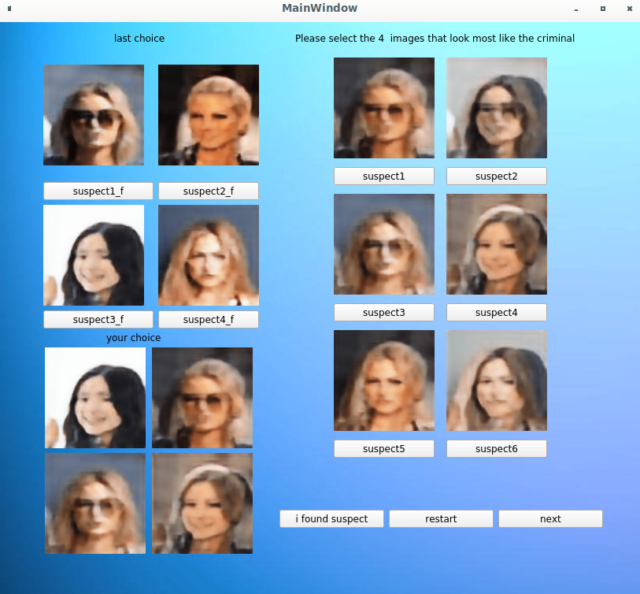
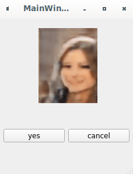

# Project_4bim

## Table of Contents
1. [Software Description ](#software-description)
2. [Repository Organization](#repository-information)
3. [Methodologies Description](#methodologies_desciption)
4. [Tutoriel](#tutoriel)
5. [Installation](#technologies)
6. [Technologies](#installation)
7. [Collaboration](#collaboration)
8. [FAQs](#faqs)

### Software Description
***
This software creates a synthesized portrait with facial features that resemble as close as possible to a criminal. The creation of the portrait is made based on a witness's successive choices between different propositions taken from a large-scale face attributes dataset. These choices are used by the software to identify the most likely facial characteristics in order to select and propose an image that corresponds to the witness's expectations and hopefully to the actual criminal. 

The software contains a user friendly Graphical User Interface and the algorithms used to propose a final portrait include a Neural Network Algorithm, that will reduce the size of the dataset images and a Genetic Algorithm that will combine and modify the image selected by the witness and propose new image.

### Repository Organization
*** 
The folder portrait_robot contains all the folders that define the software structure. In the folder portrait_robot there are 3 main folders:
Genetic_Algorithm, contains all the python, numpy and csv files needed for the genetic algorithm. 
Neural_Network, contains all the python, and numpy files needed for the neural network algorithm. 
Graphical_Inteface, contains all the the python, numpy, and png files needed for the graphical interface. This folder contains the main python file that defines the software execution. 

The folder tutorials contains two jupyther notebooks that can help you train with the Genetic Algorithm and the Neural Network Algorithm. 

The folder docs contains all the files needed to create the software's documentation. 

### Methodologies Description
Our project is based on 3 methodologies.

1.  *Neural Network*

A Neural Network Algorithm is used to reduce the size of all the dataset images for the software to modify them faster. It contains an encoder that compresses the images and a decoder that decompresses them later in order to display them.

The database used to create the software has more than 200,000 photos. With the aim of not having to train our Neural Network model on all the dataset every time the software was run, we decided to create 8 clusters of the dataset based on all the possible combinations of 3 attributes (Hairstyle, Gender and Age) that we consider reduced significantly the size of the database. Each cluster has a specific encoder and decoder and all these files needed for the Neural Network to run were created in advance. The only image kept in memory at run time are the ones that are being displayed.

2. *Genetic Algorithm*

A Genetic algorithm is used to generate a high-quality solution to the search of the criminal's face by the witness. It relies on two biological inspired operators: a mutation and a crossover. The idea is to include the witness's successive photo choices and use that information to generate new photos that contain some of the traits selected.


3. *Graphical User Interface*

In order to present a user friendly software, a Graphical User Interface was created with buttons that allow the witness to select different photos, stop and restart the program. It also displays all the photos selected in the previous steps of the software.

### Technologies
***
A list of technologies used within the project:
* [python3](https://www.python.org/downloads/): Version 3.7.3
* [Library keras](https://keras.io/about/): Version 2.8.0
* [Library tensorflow](https://www.tensorflow.org/api_docs/python/tf): Version 2.8.0
* [Library cv2](https://pypi.org/project/opencv-python/):Version 4.3.0
  $ pip3 install opencv-python
* [Library scikit-image](https://scikit-image.org/):Version 0.19.2
  $ pip3 install scikit-image
* [Large-scale CelebFaces Attributes (CelebA) Dataset](http://mmlab.ie.cuhk.edu.hk/projects/CelebA.html)

### Installation
***
To use the application you need a python environnement and you have to verify the versions of python and modules.
In addition to use the followwing instructions you need a linux terminal.  
```
$ git clone https://example.com
$ cd ../path/to/the/file
$ pip3 install keras
$ python3 mainGUI.py
Then follow the intructions of the graphic interface.
```
### Collaboration
***
You can download the project on github but you can't collaborate directly on the project (it is private).

### Tutoriel 
***
First, select an initial set of physical traits for the search. Click on the options and then click on next. 
<p align="center">

</p>

Then, 9 photos that correspond to the initial selected traits will be displayed. Select 4 of them and click on next.
<p align="center">

</p>

Then, 6 new created photos will be displayed. In the top right part of the window you can check your previous selected photos. 
You have two possibilities: 

1. Select one photo from the left buttom and 3 from the right side
2. Select 4 photos from the right side

Note that at anytime you can restart the software by clicking on restart.
<p align="center">

</p> 

All your choices will be displayed on the bottom left side of the window. 
<p align="center">

</p>
When you think you've found the best portrait, click on the I found suspect and then select the corresponding image. 
<p align="center">

</p>
Finally, confirm your choice by clicking yes. 

## FAQs
***
A list of frequently asked questions
1. **This is a question in bold**

2. __Second question in bold__

3. **Third question in bold**
.
4. **Fourth question in bold**
| Headline 1 in the tablehead | Headline 2 in the tablehead | Headline 3 in the tablehead |
|:--------------|:-------------:|--------------:|
| text-align left | text-align center | text-align right |
